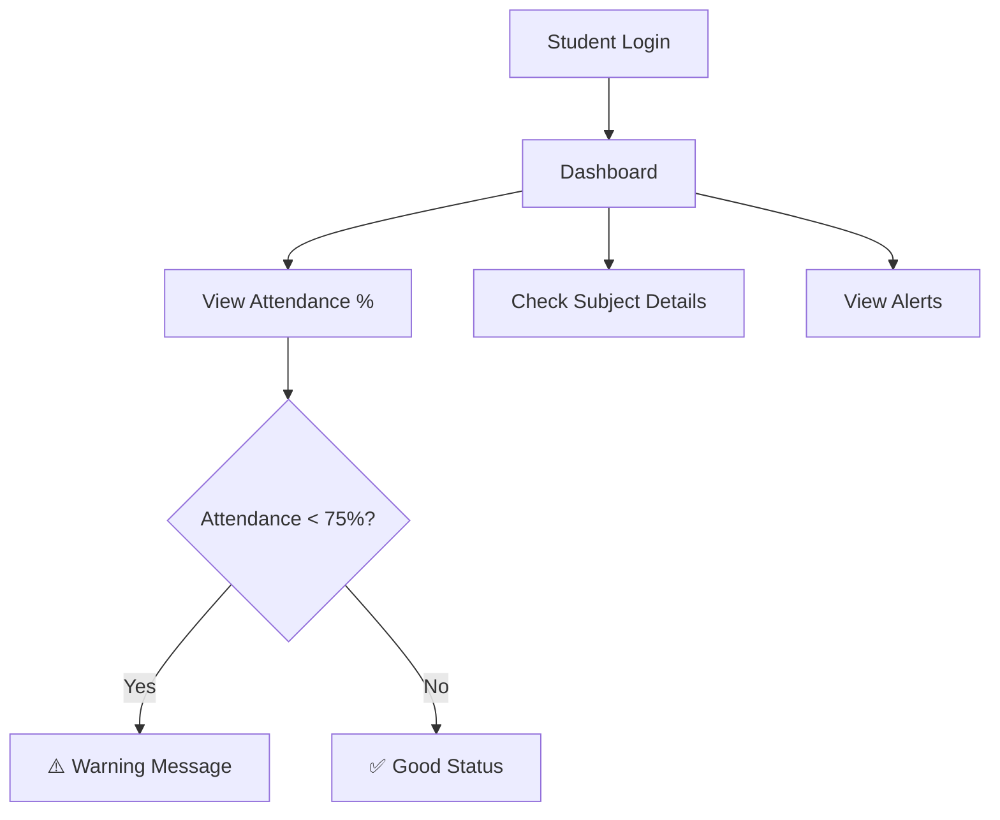
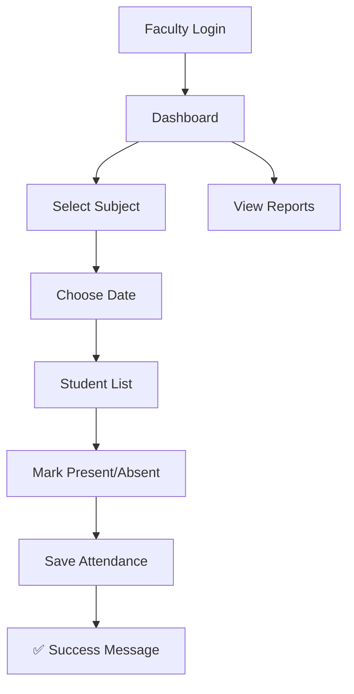
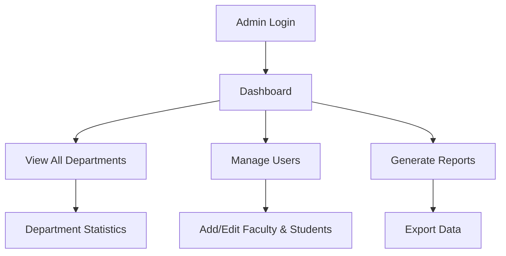

# 📚 Digital Attendance System

A simple web-based attendance management system for colleges built with PHP and MySQL.

## 🎯 What Problem Does This Solve?

- ❌ **Old Way**: Paper-based attendance (gets lost, hard to calculate)
- ✅ **New Way**: Digital system (safe, automatic calculations, real-time access)

## ⚡ Key Features

### For Students
- View attendance percentage
- Get alerts when attendance is low (below 75%)
- See attendance history

### For Faculty
- Mark student attendance easily
- View class-wise attendance reports
- Manage assigned subjects

### For Admin/HOD
- View all departments' attendance
- Generate reports
- Manage users and subjects

## 🛠 Technology Used

- **Frontend**: HTML, CSS, Bootstrap, JavaScript
- **Backend**: PHP
- **Database**: MySQL

## 📊 How It Works - User Flows

### 1. Student Journey



### 2. Faculty Journey



### 3. Admin Journey



## 💾 Database Structure

```
📁 Database Tables:
├── students (id, name, email, roll_no, department)
├── faculty (id, name, email, department)
├── subjects (id, name, code, faculty_id)
└── attendance (id, student_id, subject_id, date, status)
```

## 🚀 Quick Setup

### 1. Requirements
- Web server (XAMPP/WAMP)
- PHP 7.4+
- MySQL 5.7+

### 2. Installation Steps
```bash
# 1. Download/Clone the project
git clone https://github.com/shahdhairyah/Attendance-system.git

# 2. Copy to your web server folder
# (htdocs for XAMPP, www for WAMP)

# 3. Import database
# Open phpMyAdmin → Create database → Import database.sql

# 4. Update database settings in config.php
$servername = "localhost";
$username = "root";
$password = "";
$dbname = "attendance_system";

# 5. Open in browser
http://localhost/Attendance-system/
```

## 🔐 Demo Accounts

### Faculty Login
- **Email**: sarah.johnson@college.edu
- **Password**: password

### Student Login
- **Email**: john.smith@student.edu
- **Password**: password

## 📁 Project Files

```
📂 Project Structure:
├── index.php              # Home page
├── config.php            # Database connection
├── database.sql          # Database structure
├── login_faculty.php     # Faculty login
├── login_student.php     # Student login
├── faculty_dashboard.php # Faculty main page
├── student_dashboard.php # Student main page
├── attendance_submit.php # Save attendance
└── logout.php           # Logout page
```

## 🔒 Security Features

- ✅ Session-based login system
- ✅ Role-based access (Student/Faculty/Admin)
- ✅ Protected database queries
- ✅ Input validation

## 📈 How Attendance is Calculated

```php
// Simple calculation formula
Present Days ÷ Total Days × 100 = Attendance %

// Example: 18 present ÷ 20 total × 100 = 90%
```

## 🚀 Future Plans

### What's Coming Next:
- [ ] **Email alerts** for low attendance
- [ ] **Mobile app** version
- [ ] **Parent login** to check student attendance
- [ ] **SMS notifications**
- [ ] **Better reports** with charts
- [ ] **Biometric integration** (fingerprint)
- [ ] **Export to Excel/PDF**
- [ ] **Multi-language support**

### Technical Improvements:
- [ ] Password encryption
- [ ] Better security features
- [ ] Mobile-responsive design
- [ ] Real-time notifications
- [ ] API for mobile apps

## 🤝 How to Contribute

1. Fork this repository
2. Make your changes
3. Test everything works
4. Create a pull request

## 📞 Need Help?

- Create an issue on GitHub
- Check the demo with provided login details
- Review the code comments for understanding

## 📄 License

Free to use for educational purposes.

---

**Made for diploma colleges to make attendance tracking simple and digital! 🎓**

⭐ **Star this repo if it helps you!**
