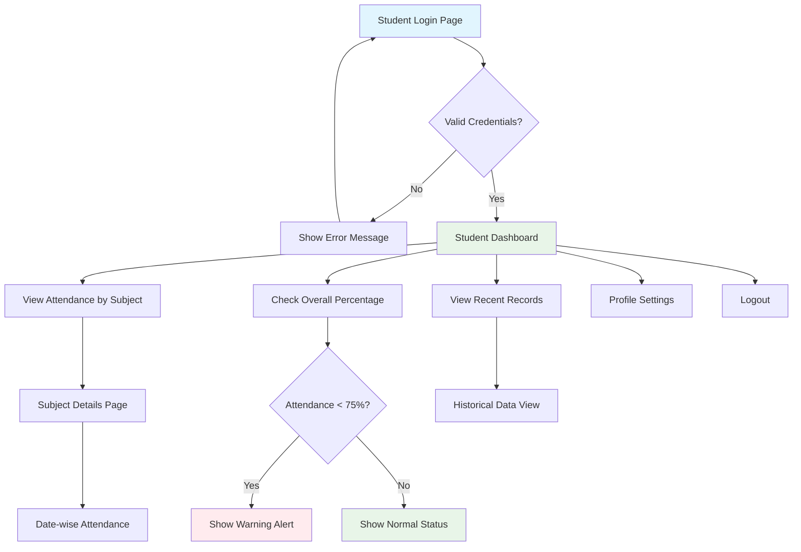
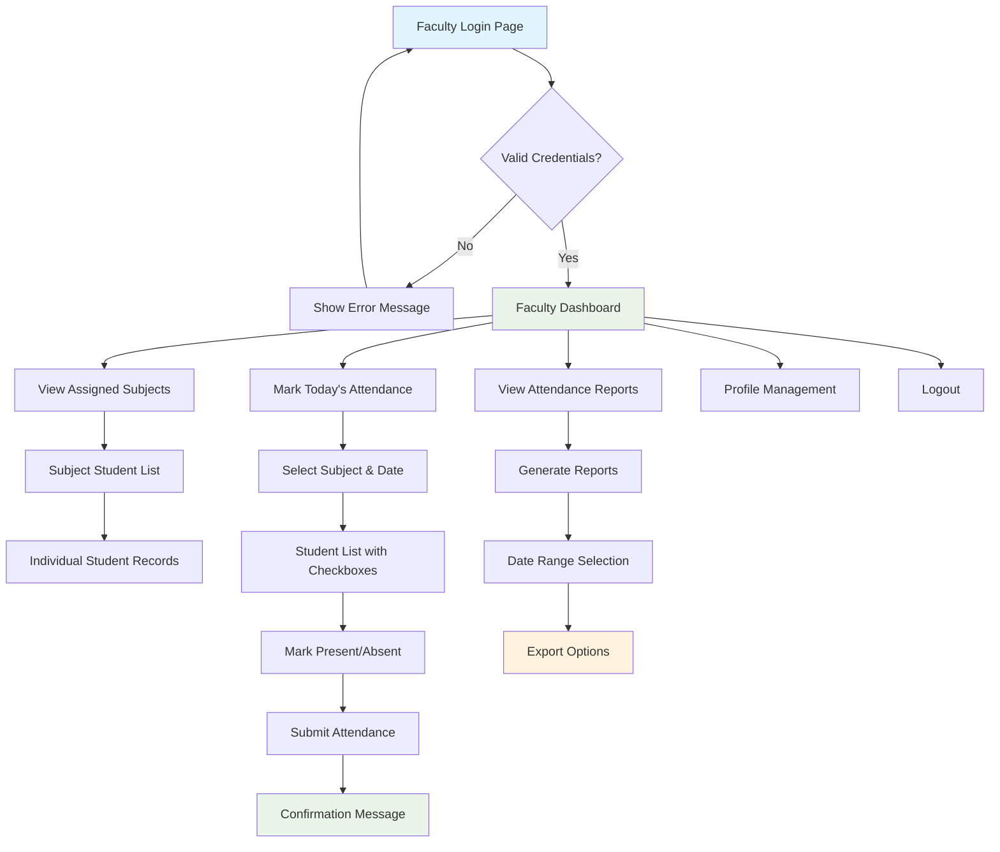
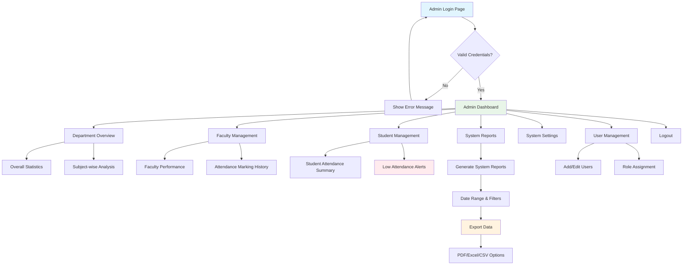

# 🎓 Digital Attendance Management System

[](https://php.net)
[](https://mysql.com)
[](https://getbootstrap.com)
[](https://developer.mozilla.org/en-US/docs/Web/JavaScript)

A comprehensive web-based attendance management system designed specifically for diploma colleges, built with modern web technologies to digitize and streamline attendance tracking processes.

## 🚀 Live Demo

- **Faculty Demo**: [sarah.johnson@college.edu](mailto:sarah.johnson@college.edu) | Password: `password`
- **Student Demo**: [john.smith@student.edu](mailto:john.smith@student.edu) | Password: `password`

## 📋 Table of Contents

- [Problem Statement](#-problem-statement)
- [Solution Overview](#-solution-overview)
- [Key Features](#-key-features)
- [Technology Stack](#-technology-stack)
- [User Flow Diagrams](#-user-flow-diagrams)
- [Database Schema](#-database-schema)
- [Installation Guide](#-installation-guide)
- [Project Structure](#-project-structure)
- [Usage Examples](#-usage-examples)
- [Security Features](#-security-features)
- [Future Enhancements](#-future-enhancements)
- [Contributing](#-contributing)
- [License](#-license)

## 🎯 Problem Statement

Many diploma colleges still rely on traditional pen-paper attendance systems, which leads to:

- **Data Loss**: Physical records can be lost or damaged
- **Manual Errors**: Human mistakes in calculation and recording
- **Limited Access**: No real-time access for students and parents
- **Time Consumption**: Lengthy administrative processes
- **Lack of Analytics**: Difficulty in generating reports and insights

## 💡 Solution Overview

Our Digital Attendance System provides a modern, web-based solution that enables:

- ✅ **Real-time Attendance Tracking**: Instant updates and calculations
- ✅ **Multi-role Access**: Different interfaces for faculty, students, and administrators
- ✅ **Automated Notifications**: Alerts for low attendance
- ✅ **Comprehensive Analytics**: Visual reports and statistics
- ✅ **Secure Authentication**: Role-based access control
- ✅ **Mobile Responsive**: Works on all devices

## 🌟 Key Features

### For Faculty
- **Secure Login System**: Email/password authentication
- **Subject Management**: View assigned subjects and student lists
- **Attendance Marking**: Easy-to-use interface for marking present/absent
- **Real-time Statistics**: View attendance overview for all subjects
- **Date-wise Records**: Access historical attendance data

### For Students
- **Student Portal**: Login with student credentials
- **Attendance Dashboard**: View attendance percentage per subject
- **Visual Analytics**: Progress bars and charts for better understanding
- **Low Attendance Alerts**: Automatic warnings when attendance drops below 75%
- **Recent History**: Track recent attendance records

### For Admin/HOD
- **Department Overview**: Complete attendance statistics
- **Faculty Management**: Monitor faculty attendance marking
- **Student Reports**: Generate comprehensive attendance reports
- **System Analytics**: Overall system usage and performance metrics
- **Data Export**: Export reports in various formats

### UI/UX Features
- **Responsive Design**: Works perfectly on desktop, tablet, and mobile devices
- **Modern UI**: Clean, professional interface with Bootstrap 5
- **Interactive Elements**: Smooth animations and hover effects
- **Role-based Navigation**: Different interfaces for each user type
- **Real-time Updates**: Dynamic content loading without page refresh

## 🛠 Technology Stack

| Layer | Technology |
|-------|------------|
| **Frontend** | HTML5, CSS3, Bootstrap 5, JavaScript |
| **Backend** | PHP 7.4+ |
| **Database** | MySQL 5.7+ |
| **Icons** | Font Awesome 6 |
| **Styling** | Custom CSS with Bootstrap Components |

## 📊 User Flow Diagrams

### 1. Student User Flow



### 2. Faculty User Flow



### 3. Admin/HOD User Flow



## 🗄 Database Schema

### Tables Structure

#### `students`
- `id` (Primary Key)
- `name`, `roll_no`, `email`, `password`
- `department`, `created_at`

#### `faculty`
- `id` (Primary Key)
- `name`, `email`, `password`
- `department`, `created_at`

#### `subjects`
- `id` (Primary Key)
- `subject_name`, `subject_code`
- `faculty_id` (Foreign Key)
- `department`, `created_at`

#### `attendance`
- `id` (Primary Key)
- `student_id`, `subject_id` (Foreign Keys)
- `date`, `status` (P/A)
- `marked_by`, `created_at`

## 🔧 Installation Guide

### Prerequisites
- Web server (Apache/Nginx)
- PHP 7.4 or higher
- MySQL 5.7 or higher
- Modern web browser

### Step-by-Step Installation

1. **Clone/Download the project**
   ```bash
   git clone https://github.com/shahdhairyah/Attendance-system.git
   cd Attendance-system
   ```

2. **Setup Web Server**
   ```bash
   # Place all files in your web server directory
   # e.g., /var/www/html/ or htdocs/
   ```

3. **Database Setup**
   ```sql
   # Import the database schema
   mysql -u username -p < database.sql
   ```

4. **Configure Database Connection**
   ```php
   // Edit config.php with your database credentials
   $servername = "localhost";
   $username = "your_username";
   $password = "your_password";
   $dbname = "attendance_system";
   ```

5. **Access the Application**
   ```
   http://localhost/your-project-folder/
   ```

## 📁 Project Structure

```
Digital-Attendance-System/
├── index.php                 # Homepage
├── config.php               # Database configuration
├── database.sql             # Database schema
├── login_faculty.php        # Faculty login page
├── login_student.php        # Student login page
├── faculty_dashboard.php    # Faculty main dashboard
├── student_dashboard.php    # Student main dashboard
├── attendance_submit.php    # Attendance processing
├── logout.php              # Session management
├── assets/
│   ├── css/                # Custom stylesheets
│   ├── js/                 # JavaScript files
│   └── images/             # Image assets
└── README.md               # Project documentation
```

## 💻 Usage Examples

### Attendance Calculation
The system automatically calculates attendance percentages using:

```sql
SELECT 
    (COUNT(CASE WHEN status = 'P' THEN 1 END) * 100.0 / COUNT(*)) as percentage
FROM attendance 
WHERE student_id = ? AND subject_id = ?
```

### Low Attendance Alerts
Automatic notifications when attendance falls below 75%:
- Visual warnings on student dashboard
- Color-coded progress indicators
- Summary statistics highlighting low attendance subjects

## 🔒 Security Features

- **Session Management**: Secure login/logout functionality
- **Role-based Access**: Different permissions for faculty and students
- **SQL Injection Prevention**: Prepared statements for database queries
- **Input Validation**: Server-side validation for all forms
- **Password Security**: Hashed password storage (ready for implementation)

## 🚀 Future Enhancements

### Planned Features
- [ ] **Email Notifications**: Automated alerts for low attendance
- [ ] **SMS Integration**: Real-time SMS alerts to students and parents
- [ ] **Advanced Reporting**: Export features with multiple formats (PDF, Excel, CSV)
- [ ] **Mobile Application**: Native Android/iOS apps
- [ ] **API Integration**: RESTful APIs for third-party integrations
- [ ] **Biometric Integration**: Fingerprint/face recognition attendance
- [ ] **Parent Portal**: Parent access to monitor student attendance
- [ ] **Multi-language Support**: Localization for different languages
- [ ] **Advanced Analytics**: Machine learning for attendance prediction
- [ ] **Blockchain Integration**: Immutable attendance records

### Technical Improvements
- [ ] **Password Hashing**: Implement bcrypt for secure password storage
- [ ] **Two-Factor Authentication**: Enhanced security with 2FA
- [ ] **Database Optimization**: Query optimization and indexing
- [ ] **Caching System**: Redis/Memcached for better performance
- [ ] **Error Logging**: Comprehensive error tracking and logging
- [ ] **Unit Testing**: Automated testing framework implementation
- [ ] **CI/CD Pipeline**: Automated deployment and testing
- [ ] **Docker Support**: Containerization for easy deployment

### UI/UX Enhancements
- [ ] **Dark Mode**: Theme switching capability
- [ ] **Progressive Web App**: PWA features for mobile experience
- [ ] **Real-time Notifications**: WebSocket integration for live updates
- [ ] **Advanced Charts**: Interactive charts and visualizations
- [ ] **Accessibility**: WCAG compliance for better accessibility

## 🤝 Contributing

We welcome contributions from the community! Here's how you can help:

1. **Fork the repository**
2. **Create a feature branch**
   ```bash
   git checkout -b feature/amazing-feature
   ```
3. **Make your changes**
4. **Test thoroughly**
5. **Commit your changes**
   ```bash
   git commit -m 'Add some amazing feature'
   ```
6. **Push to the branch**
   ```bash
   git push origin feature/amazing-feature
   ```
7. **Submit a Pull Request**

### Development Guidelines
- Follow PSR-12 coding standards for PHP
- Use meaningful commit messages
- Add comments for complex logic
- Test your changes before submitting
- Update documentation as needed

## 📄 License

This project is created for educational purposes and is free to use and modify under the MIT License.

## 📧 Support & Contact

For technical support or questions:
- **Issues**: [GitHub Issues](https://github.com/shahdhairyah/Attendance-system/issues)
- **Discussions**: [GitHub Discussions](https://github.com/shahdhairyah/Attendance-system/discussions)
- **Documentation**: Check this README and code comments
- **Demo**: Use the provided demo credentials for testing

## 🎯 Project Goals

This project aims to:
- **Digitize** traditional attendance systems in diploma colleges
- **Reduce** manual errors and administrative workload
- **Provide** real-time access to attendance data
- **Enhance** student engagement through transparency
- **Enable** data-driven decisions for educational institutions

---

**Developed for Diploma Colleges** - Bridging the gap between traditional and digital attendance management

⭐ **Star this repository if you find it helpful!**
