# 📚 Digital Attendance System

A simple web-based attendance management system for colleges built with PHP and MySQL. This system replaces traditional paper-based attendance with a modern digital solution.

## 🎯 What Problem Does This Solve?

### Current Problems in Colleges:
- ❌ **Paper Records**: Attendance sheets get lost or damaged
- ❌ **Manual Calculation**: Teachers spend hours calculating percentages
- ❌ **No Real-time Access**: Students can't check their attendance instantly
- ❌ **Human Errors**: Wrong calculations and missed entries
- ❌ **Time Consuming**: Long queues and manual processes

### Our Digital Solution:
- ✅ **Secure Storage**: All data saved in database, never lost
- ✅ **Auto Calculation**: System calculates percentages automatically
- ✅ **Real-time Updates**: Students see attendance immediately
- ✅ **Error-free**: No manual calculation mistakes
- ✅ **Time Saving**: Quick marking and instant reports

## ⚡ Key Features

### For Students 👨‍🎓
- **Dashboard**: See all subjects and attendance at one place
- **Percentage View**: Real-time attendance percentage for each subject
- **Alert System**: Get warnings when attendance drops below 75%
- **History**: View day-by-day attendance records
- **Mobile Friendly**: Access from phone, tablet, or computer

### For Faculty 👩‍🏫
- **Easy Marking**: Mark attendance with simple clicks
- **Subject Management**: View all assigned subjects and students
- **Quick Reports**: Generate attendance reports instantly
- **Date Selection**: Mark attendance for any date
- **Student Overview**: See individual student performance

### For Admin/HOD 👨‍💼
- **Department Control**: Manage entire department attendance
- **User Management**: Add/remove students and faculty
- **Complete Reports**: Generate college-wide reports
- **Data Export**: Download reports in Excel/PDF format
- **System Monitoring**: Track system usage and performance

## 🛠 Technology Stack

| Component | Technology | Purpose |
|-----------|------------|---------|
| **Frontend** | HTML5, CSS3, Bootstrap 5 | User interface design |
| **Backend** | PHP 7.4+ | Server-side logic |
| **Database** | MySQL 5.7+ | Data storage |
| **JavaScript** | Vanilla JS | Interactive features |
| **Icons** | Font Awesome | Beautiful icons |

## 📊 Real-World Examples with User Flows

### Example 1: Student Checking Attendance

**Scenario**: Rahul wants to check his Math attendance

```mermaid
flowchart TD
    A[Rahul opens website] --> B[Clicks 'Student Login']
    B --> C[Enters: rahul@student.edu<br/>Password: student123]
    C --> D[Sees Dashboard with all subjects]
    D --> E[Mathematics: 78% attendance<br/>Physics: 65% attendance ⚠️<br/>Chemistry: 85% attendance]
    E --> F[Clicks on Physics]
    F --> G[Sees detailed view:<br/>Present: 13 days<br/>Absent: 7 days<br/>Total: 20 days]
    G --> H[Gets warning: 'Attendance below 75%!<br/>Attend next 5 classes']
```



### Example 2: Faculty Marking Attendance

**Scenario**: Prof. Sharma marking attendance for Computer Science class

```mermaid
flowchart TD
    A[Prof. Sharma logs in] --> B[Sees assigned subjects:<br/>• Computer Science - 30 students<br/>• Database - 25 students]
    B --> C[Selects 'Computer Science']
    C --> D[Chooses today's date: 09-06-2025]
    D --> E[Sees student list with checkboxes:<br/>☑️ Amit Kumar - Present<br/>☐ Priya Patel - Absent<br/>☑️ Rohit Singh - Present]
    E --> F[Marks attendance for all 30 students]
    F --> G[Clicks 'Submit Attendance']
    G --> H[Success: 'Attendance saved!<br/>Present: 28, Absent: 2']
```




### Example 3: Admin Generating Reports

**Scenario**: HOD Dr. Gupta generating monthly report

```mermaid
flowchart TD
    A[Dr. Gupta logs in as Admin] --> B[Dashboard shows:<br/>Total Students: 150<br/>Total Faculty: 12<br/>Avg Attendance: 82%]
    B --> C[Clicks 'Generate Reports']
    C --> D[Selects filters:<br/>Department: Computer Science<br/>Date: May 2025<br/>Type: Monthly Report]
    D --> E[System processes data]
    E --> F[Shows report:<br/>Top performer: CSE-A (89%)<br/>Needs attention: CSE-C (71%)<br/>Faculty performance: All good]
    F --> G[Clicks 'Export to Excel']
    G --> H[Downloads: CS_Attendance_May2025.xlsx]
```

## 💾 Database Structure (Detailed)

### Students Table
```sql
CREATE TABLE students (
    id INT PRIMARY KEY AUTO_INCREMENT,
    name VARCHAR(100) NOT NULL,
    roll_no VARCHAR(20) UNIQUE,
    email VARCHAR(100) UNIQUE,
    password VARCHAR(255),
    department VARCHAR(50),
    semester INT,
    created_at TIMESTAMP DEFAULT CURRENT_TIMESTAMP
);

-- Example Data:
-- id=1, name="Rahul Kumar", roll_no="CS001", email="rahul@student.edu"
```

### Faculty Table
```sql
CREATE TABLE faculty (
    id INT PRIMARY KEY AUTO_INCREMENT,
    name VARCHAR(100) NOT NULL,
    email VARCHAR(100) UNIQUE,
    password VARCHAR(255),
    department VARCHAR(50),
    phone VARCHAR(15),
    created_at TIMESTAMP DEFAULT CURRENT_TIMESTAMP
);

-- Example Data:
-- id=1, name="Prof. Sharma", email="sharma@college.edu"
```

### Subjects Table
```sql
CREATE TABLE subjects (
    id INT PRIMARY KEY AUTO_INCREMENT,
    subject_name VARCHAR(100) NOT NULL,
    subject_code VARCHAR(10) UNIQUE,
    faculty_id INT,
    department VARCHAR(50),
    semester INT,
    credits INT,
    created_at TIMESTAMP DEFAULT CURRENT_TIMESTAMP
);

-- Example Data:
-- id=1, subject_name="Mathematics", subject_code="MATH101", faculty_id=1
```

### Attendance Table
```sql
CREATE TABLE attendance (
    id INT PRIMARY KEY AUTO_INCREMENT,
    student_id INT,
    subject_id INT,
    date DATE,
    status ENUM('P', 'A') DEFAULT 'A',
    marked_by INT,
    created_at TIMESTAMP DEFAULT CURRENT_TIMESTAMP
);

-- Example Data:
-- student_id=1, subject_id=1, date="2025-06-09", status="P"
```

## 🚀 Quick Setup Guide

### Step 1: Requirements Check
```bash
✅ Web Server (XAMPP/WAMP/LAMP)
✅ PHP 7.4 or higher
✅ MySQL 5.7 or higher
✅ Web Browser (Chrome, Firefox, Safari)
```

### Step 2: Installation
```bash
# 1. Download the project
git clone https://github.com/shahdhairyah/Attendance-system.git

# 2. Move to web server directory
# For XAMPP: C:/xampp/htdocs/
# For WAMP: C:/wamp64/www/
# For Linux: /var/www/html/

# 3. Create database
# Open phpMyAdmin (http://localhost/phpmyadmin)
# Create new database: "attendance_system"
# Import the database.sql file

# 4. Configure database connection
# Edit config.php file:
```

### Step 3: Configuration File (config.php)
```php
<?php
$servername = "localhost";
$username = "root";           // Your MySQL username
$password = "";               // Your MySQL password
$dbname = "attendance_system"; // Database name

// Test connection
$conn = new mysqli($servername, $username, $password, $dbname);
if ($conn->connect_error) {
    die("Connection failed: " . $conn->connect_error);
}
echo "Connected successfully!";
?>
```

### Step 4: Access the System
```
🌐 Open in browser: http://localhost/Attendance-system/
📱 Mobile access: Same URL works on mobile devices
```

## 🔐 Demo Accounts (Ready to Use)

### Faculty Account
- **Email**: sarah.johnson@college.edu
- **Password**: password
- **Department**: Computer Science
- **Assigned Subjects**: Mathematics, Physics

### Student Account
- **Email**: john.smith@student.edu
- **Password**: password
- **Roll No**: CS001
- **Department**: Computer Science

### Admin Account
- **Email**: admin@college.edu
- **Password**: admin123
- **Role**: HOD/Administrator
- **Access**: Full system control

## 📁 Project Structure (Detailed)

```
📂 Attendance-System/
├── 📄 index.php                 # Homepage with login options
├── 📄 config.php               # Database connection settings
├── 📄 database.sql             # Complete database structure with sample data
├── 📄 login_faculty.php        # Faculty login form and validation
├── 📄 login_student.php        # Student login form and validation
├── 📄 login_admin.php          # Admin login form and validation
├── 📄 faculty_dashboard.php    # Faculty main dashboard
├── 📄 student_dashboard.php    # Student main dashboard
├── 📄 admin_dashboard.php      # Admin main dashboard
├── 📄 mark_attendance.php      # Attendance marking interface
├── 📄 view_attendance.php      # Attendance viewing page
├── 📄 reports.php              # Report generation page
├── 📄 attendance_submit.php    # Process attendance submission
├── 📄 logout.php              # Handle user logout
├── 📂 assets/
│   ├── 📂 css/
│   │   ├── style.css          # Custom styles
│   │   └── bootstrap.min.css  # Bootstrap framework
│   ├── 📂 js/
│   │   ├── script.js          # Custom JavaScript
│   │   └── bootstrap.min.js   # Bootstrap JavaScript
│   └── 📂 images/
│       ├── logo.png           # College logo
│       └── avatars/           # User profile pictures
└── 📄 README.md               # This documentation
```

## 🔒 Security Features (Detailed)

### Login Security
```php
// Example: Session-based authentication
session_start();
if (!isset($_SESSION['user_id']) || $_SESSION['role'] != 'faculty') {
    header("Location: login_faculty.php");
    exit();
}
```

### Data Protection
- ✅ **SQL Injection Prevention**: Using prepared statements
- ✅ **XSS Protection**: Input sanitization and output encoding
- ✅ **Session Management**: Secure session handling
- ✅ **Role-based Access**: Different permissions for each user type
- ✅ **Password Protection**: Encrypted password storage (planned)

## 📈 How Attendance Calculation Works

### Real Example:
```
Student: Rahul Kumar
Subject: Mathematics
Month: May 2025

Classes Held: 22 days
Classes Attended: 18 days
Classes Missed: 4 days

Calculation:
Attendance % = (18 ÷ 22) × 100 = 81.82%

Status: ✅ Good (Above 75%)
```

### PHP Code for Calculation:
```php
function calculateAttendance($student_id, $subject_id) {
    $total_query = "SELECT COUNT(*) as total FROM attendance 
                   WHERE student_id = ? AND subject_id = ?";
    
    $present_query = "SELECT COUNT(*) as present FROM attendance 
                     WHERE student_id = ? AND subject_id = ? AND status = 'P'";
    
    // Execute queries and calculate percentage
    $percentage = ($present_count / $total_count) * 100;
    
    return round($percentage, 2);
}
```

## 🎨 User Interface Examples

### Student Dashboard Layout
```
┌─────────────────────────────────────────┐
│ 👋 Welcome, Rahul Kumar (CS001)         │
├─────────────────────────────────────────┤
│ 📊 Your Attendance Overview             │
│                                         │
│ Mathematics     [████████░░] 81%        │
│ Physics         [██████░░░░] 65% ⚠️      │
│ Chemistry       [█████████░] 89%        │
│ Database        [███████░░░] 76%        │
│                                         │
│ 🔔 Alerts: Physics attendance is low!   │
│ 📅 Last updated: June 09, 2025         │
└─────────────────────────────────────────┘
```

### Faculty Attendance Marking Interface
```
┌─────────────────────────────────────────┐
│ Mark Attendance - Mathematics           │
│ Date: June 09, 2025 | Total: 30        │
├─────────────────────────────────────────┤
│ ☑️ 001 - Rahul Kumar      [Present]     │
│ ☐  002 - Priya Patel     [Absent]      │
│ ☑️ 003 - Amit Singh      [Present]     │
│ ☑️ 004 - Neha Sharma     [Present]     │
│ ...                                     │
│                                         │
│ [Mark All Present] [Submit Attendance]  │
└─────────────────────────────────────────┘
```

## 🚀 Future Enhancements (Detailed Roadmap)

### Phase 1: Immediate Improvements (Next 3 months)
- [ ] **Email Notifications**: 
  - Send weekly attendance reports to students
  - Alert parents when attendance drops below 75%
  - Notify faculty about unmarked attendance
  
- [ ] **Better Security**:
  - Password encryption with bcrypt
  - Two-factor authentication for admin
  - Session timeout after inactivity

- [ ] **Mobile Responsiveness**:
  - Optimize for smartphone screens
  - Touch-friendly interface
  - Offline capability for marking attendance

### Phase 2: Advanced Features (3-6 months)
- [ ] **SMS Integration**:
  - Daily attendance SMS to parents
  - Low attendance warnings via SMS
  - Class cancellation notifications

- [ ] **Advanced Reports**:
  - Graphical charts and trends
  - Export to Excel, PDF, CSV
  - Comparative analysis between classes

- [ ] **Parent Portal**:
  - Parents can view child's attendance
  - Monthly attendance summary emails
  - Communication with faculty

### Phase 3: Professional Features (6-12 months)
- [ ] **Mobile App**:
  - Android and iOS native apps
  - Push notifications
  - Offline attendance marking

- [ ] **Biometric Integration**:
  - Fingerprint attendance marking
  - Face recognition for students
  - RFID card support

- [ ] **API Development**:
  - REST API for third-party integration
  - Integration with college management systems
  - Real-time data synchronization

### Phase 4: Advanced Analytics (1+ years)
- [ ] **AI-Powered Features**:
  - Predict student dropout risk
  - Attendance pattern analysis
  - Automated report generation

- [ ] **Multi-College Support**:
  - Support multiple colleges in one system
  - College-wise data separation
  - Centralized admin panel

## 📊 Sample Data Examples

### Attendance Report Example
```
College: ABC Engineering College
Department: Computer Science
Month: May 2025

Top 5 Students by Attendance:
1. Priya Sharma (CS002) - 96.7%
2. Rahul Kumar (CS001) - 89.3%
3. Amit Singh (CS003) - 87.1%
4. Neha Patel (CS004) - 83.5%
5. Rohit Gupta (CS005) - 81.2%

Subjects with Low Attendance:
1. Physics - Average: 68.4%
2. Mathematics - Average: 72.8%
3. Chemistry - Average: 76.1%

Faculty Performance:
- Prof. Sharma: 98% attendance marking rate
- Prof. Patel: 95% attendance marking rate
- Prof. Kumar: 92% attendance marking rate
```

## 🤝 How to Contribute

### For Beginners:
1. **Fork** this repository on GitHub
2. **Download** your forked version
3. **Make changes** (fix bugs, add features)
4. **Test** your changes thoroughly
5. **Upload** back to your GitHub
6. **Create Pull Request** to merge with main project

### What You Can Contribute:
- 🐛 **Bug Fixes**: Found a problem? Fix it!
- ✨ **New Features**: Add features from the roadmap
- 📖 **Documentation**: Improve this README or add comments
- 🎨 **UI Improvements**: Make it look better
- 🔧 **Code Optimization**: Make it run faster

### Coding Guidelines:
```php
// Use clear variable names
$student_attendance_percentage = 85; // Good
$sap = 85; // Bad

// Add comments for complex logic
// Calculate attendance percentage for the student
$percentage = ($present_days / $total_days) * 100;

// Use consistent formatting
if ($attendance < 75) {
    echo "Low attendance warning!";
} else {
    echo "Good attendance!";
}
```

## 📞 Support & Help

### Need Help?
- 📧 **Create Issue**: [GitHub Issues Page](https://github.com/shahdhairyah/Attendance-system/issues)
- 💬 **Discussion**: Use GitHub Discussions for questions
- 📖 **Documentation**: Read this README carefully
- 🔍 **Demo**: Try the system with provided demo accounts

### Common Problems & Solutions:
1. **Database Connection Error**: Check config.php settings
2. **Login Not Working**: Verify demo credentials
3. **Attendance Not Saving**: Check database permissions
4. **Page Not Loading**: Ensure web server is running

## 📄 License

This project is **free to use** for:
- ✅ Educational purposes
- ✅ College projects
- ✅ Learning PHP and MySQL
- ✅ Non-commercial use

**Commercial use**: Contact the developer for permission.

## 🎓 Educational Value

This project is perfect for learning:
- **PHP Programming**: Server-side scripting
- **MySQL Database**: Data storage and retrieval
- **Web Development**: HTML, CSS, JavaScript
- **Project Management**: Real-world application development
- **User Experience**: Different user roles and interfaces

---

## 🌟 Why Choose This System?

| Traditional Method | Our Digital System |
|-------------------|-------------------|
| Paper attendance sheets | Secure digital database |
| Manual calculations | Automatic percentage calculation |
| No real-time access | Instant attendance viewing |
| Prone to errors | Error-free digital system |
| Time-consuming | Quick and efficient |
| Limited reporting | Comprehensive reports |

**Made with ❤️ for diploma colleges to modernize attendance management!**

⭐ **If this project helps you, please star the repository!**

📢 **Share with your friends and colleagues who might find this useful!**
